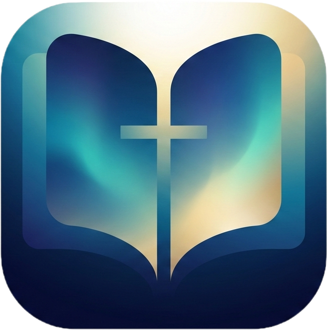

<p align="center">
  
</p>

<h1 align="center">📖 개역개정 성경</h1>

<p align="center">
  <strong>개역개정 한글 성경 · 찬송가 악보 · PWA 웹앱</strong>
</p>

<p align="center">
  
  
  
  
  
  
</p>

---

## ✨ 소개

개역개정 한글 성경을 온라인으로 읽고, 구절을 선택하여 공유할 수 있는 **모바일 퍼스트 웹 애플리케이션**입니다.  
성경 66권(구약 39권 + 신약 27권)의 전체 본문과 **645곡의 찬송가 악보**를 제공합니다.

> 📱 PWA를 지원하여 홈 화면에 설치하면 네이티브 앱처럼 사용할 수 있습니다.

---

## 🎯 주요 기능

| 기능 | 설명 |
|------|------|
| 📚 **성경 읽기** | 구약/신약 66권, 장·절 단위 탐색 |
| 🎵 **찬송가 악보** | 645곡 악보 이미지 뷰어 (Firebase Storage) |
| 🔗 **구절 공유** | 구절 선택 → 클립보드 복사 / 네이티브 공유 |
| 🖍️ **형광펜** | 5색 하이라이트 (노랑/초록/분홍/파랑/보라) + 영구 저장 |
| ⚙️ **사용자 설정** | 다크모드, 글자 크기, 글씨체, 굵기, 하단 정렬, 본문 폭 |
| 👆 **스와이프** | 탭 전환 및 장/찬송가 이동을 위한 터치 제스처 |
| 🔒 **화면 꺼짐 방지** | Wake Lock API로 읽는 중 화면 유지 |
| 📱 **PWA** | 홈 화면 설치, 오프라인 캐싱 |

---

## 🛠️ 기술 스택

```
Backend     Node.js · Express
Frontend    Vanilla JS · CSS (프레임워크 없음)
Database    MongoDB Atlas (성경 + 찬송가)
Storage     Firebase Storage (악보 이미지)
Deploy      Vercel (Serverless)
PWA         Service Worker (Cache First + Network First)
```

---

## 📁 프로젝트 구조

```
project4_bible_app/
├── server.js               # Express 서버 (API + 정적 파일)
├── package.json            # 의존성 관리
├── vercel.json             # Vercel 배포 설정
├── .env                    # 환경 변수
├── icon.png                # 앱 아이콘
│
└── public/                 # 프론트엔드 (멀티페이지)
    ├── index.html          # 메인 — 책 목록 (구약/신약/찬송가 탭)
    ├── books.js            # 메인 페이지 로직
    ├── chapters.html/js    # 장 선택 그리드
    ├── verses.html/js      # 구절 읽기
    ├── hymns.html/js       # 찬송가 목록
    ├── hymn.html/js        # 찬송가 악보 상세
    ├── common.js           # 공통 유틸 (fetchJSON, 설정, 토스트)
    ├── style.css           # 전체 스타일시트
    ├── service-worker.js   # PWA 서비스 워커 (v23)
    ├── manifest.json       # PWA 매니페스트
    └── icons/              # PWA 아이콘 (72~512px, 8종)
```

---

## 🔌 API 엔드포인트

| Method | Endpoint | 설명 |
|--------|----------|------|
| `GET` | `/api/books` | 성경 66권 목록 |
| `GET` | `/api/books/:bookIndex/chapters` | 특정 책의 장 목록 |
| `GET` | `/api/books/:bookIndex/chapters/:chapter` | 특정 장의 전체 구절 |
| `GET` | `/api/hymns` | 찬송가 전체 목록 |
| `GET` | `/api/hymns/:chapter` | 특정 찬송가 상세 정보 |

---

## 🚀 시작하기

### 사전 요구사항

- [Node.js](https://nodejs.org/) (v18+)
- [MongoDB Atlas](https://www.mongodb.com/atlas) 계정
- [Firebase](https://firebase.google.com/) 프로젝트 (Storage)

### 설치 및 실행

```bash
# 1. 저장소 클론
git clone https://github.com/your-username/bible-app.git
cd bible-app

# 2. 의존성 설치
npm install

# 3. 환경 변수 설정
cp .env.example .env
# .env 파일에 아래 값을 입력하세요
```

### 환경 변수 (.env)

```env
MONGODB_URI=mongodb+srv://...          # Bible DB 연결 문자열
MONGODB_URI_HYMN=mongodb+srv://...     # Hymn DB 연결 문자열
FIREBASE_STORAGE_BUCKET=your-bucket    # Firebase Storage 버킷명
ALLOWED_ORIGINS=https://your-domain    # CORS 허용 출처 (쉼표 구분)
```

### 실행

```bash
npm run dev    # http://localhost:3000
```

---

## 🏗️ 아키텍처

```
┌──────────────────────────────────────────────┐
│  Client (Browser)                            │
│  멀티페이지 아키텍처 (MPA)                     │
│  index / chapters / verses / hymns / hymn     │
│  + Service Worker (v23)                       │
│    · 정적 파일: Cache First                    │
│    · API: Network First                       │
│    · 외부(Firebase): 패스스루                   │
└──────────────────┬───────────────────────────┘
                   │ HTTPS
┌──────────────────┴───────────────────────────┐
│  Server (Vercel Serverless)                  │
│  Express.js                                  │
│  Helmet → CORS → Rate Limit → Slow Down      │
└──────┬────────────────────────────┬──────────┘
       │                            │
┌──────▼──────┐             ┌───────▼───────┐
│  MongoDB    │             │   Firebase    │
│  Atlas      │             │   Storage     │
│ · bible_db  │             │  찬송가 악보    │
│ · Hymn      │             │  JPG (645곡)  │
└─────────────┘             └───────────────┘
```

---

## 🔐 보안

- **Helmet** — CSP, HSTS 등 HTTP 보안 헤더 자동 적용
- **CORS** — 허용된 출처만 API 접근 가능
- **Rate Limiter** — IP당 1분 100회 요청 제한
- **Slow Down** — 80회 초과 시 점진적 응답 지연 (최대 5초)
- **Body Limit** — 요청 본문 10KB 제한

---

## 📦 의존성

| 패키지 | 용도 |
|--------|------|
| `express` | 웹 프레임워크 |
| `mongodb` | MongoDB 드라이버 |
| `helmet` | HTTP 보안 헤더 |
| `cors` | CORS 정책 관리 |
| `express-rate-limit` | 요청 수 제한 |
| `express-slow-down` | 요청 속도 제한 |
| `dotenv` | 환경 변수 로딩 |

---

## 🗄️ 데이터베이스 스키마

### Bible DB (`bible_db.verses`)

```json
{
    "bookIndex": 1,
    "bookName": "창세기",
    "testament": "Old",
    "chapter": 1,
    "verse": 1,
    "content": "태초에 하나님이 천지를 창조하시니라",
    "headline": "천지 창조"
}
```

### Hymn DB (`Hymn.hymns`)

```json
{
    "chapter": 1,
    "downloadUrl": "https://firebasestorage.googleapis.com/..."
}
```

---

## 📱 PWA 지원

- **홈 화면 설치**: 브라우저 ➜ "홈 화면에 추가"로 네이티브 앱처럼 사용
- **오프라인 캐싱**: 한번 열어본 페이지는 오프라인에서도 접근 가능
- **8종 아이콘**: 72px ~ 512px 다양한 사이즈 지원
- **세로 고정**: `orientation: portrait`

---

## 🎨 UI/UX 특징

- **다크/라이트 테마** — CSS 변수 기반 완전한 테마 전환
- **스와이프 네비게이션** — 구약/신약/찬송가 탭 전환, 장 이동
- **형광펜 5색** — 노랑·초록·분홍·파랑·보라 + 롱프레스 색상 선택
- **캐러셀 인디케이터** — 상단 챕터 스크롤 (스냅 포인트, 마스크 그라데이션)
- **반응형 그리드** — 480px / 768px / 1200px 브레이크포인트
- **토스트 알림** — 복사 성공 등 피드백
- **로딩 스피너** — 글로우 효과 그라데이션 보더

---

## 📋 개발 타임라인

| 날짜 | 주요 작업 |
|------|-----------|
| 2026-01-12 | 프로젝트 시작, 버튼 디자인, 모바일 반응형 |
| 2026-02-14 | 버튼 애니메이션 조정 |
| 2026-02-22 | 설정 패널, 찬송가 악보 다운로더, MongoDB 저장 |
| 2026-02-23 | 찬송가 이미지 로딩 문제 해결 (CSP, SW 패스스루) |
| 2026-03-03 | MPA 아키텍처 전환, 히스토리 버그 수정 |
| 2026-03-04 | 찬송가 탭 인라인 통합, 캐러셀 개선, 형광펜 기능 |
| 2026-03-05 | 형광펜 5색 + 색상 선택 팝업 |
| 2026-03-07 | Wake Lock, 본문 폭 조절, 에이전트 시스템 도입 |

---

## 📄 라이선스

이 프로젝트는 개인 프로젝트로 제작되었습니다.  
성경 본문은 **개역개정** 번역본을 사용합니다.

---

<p align="center">
  <sub>Made with ❤️ for Bible study</sub>
</p>
